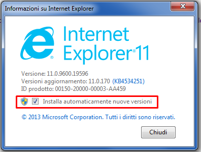
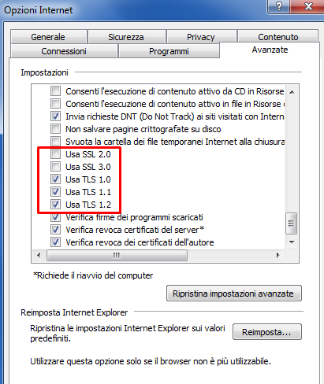

<p align="center" >
  
</p>

# Overview.

This repository provide a simple script designed to facilitate the downloading of films and series from a popular streaming community platform. The script allows users to download individual films, entire series, or specific episodes, providing a seamless experience for content consumers.

## Join us
You can chat, help improve this repo, or just hang around for some fun in the **Git_StreamingCommunity** Discord [Server](https://discord.com/invite/8vV68UGRc7)
# Table of Contents

* [INSTALLATION](#installation)
  * [Requirement](#requirement)
  * [Usage](#usage)
  * [Update](#update)
  * [Win 7](#win-7)
* [CONFIGURATION](#Configuration)
* [DOCKER](#docker)
* [TUTORIAL](#tutorial)
* [TO DO](#to-do)

## Requirement

Make sure you have the following prerequisites installed on your system:

* python > [3.11](https://www.python.org/downloads/)
* ffmpeg [win](https://www.gyan.dev/ffmpeg/builds/)

## Installation

Install the required Python libraries using the following command:

```
pip install -r requirements.txt
```

## Usage

Run the script with the following command:

#### On Windows:

```powershell
python run.py
```

#### On Linux/MacOS:

```bash
python3 run.py
```

## Update

Keep your script up to date with the latest features by running:

#### On Windows:

```powershell
python update.py
```

#### On Linux/MacOS:

```bash
python3 update.py
```

## Win 7

Windows 7 does not enforce TLS 1.2 by default, which can lead to security issues. Follow these steps to ensure TLS 1.2 is enabled:

1. **Update Internet Explorer**:
  - Ensure Internet Explorer is updated to the latest version (11). 
  
   
2. **Enable TLS 1.1 and TLS 1.2**:
  - Open Internet Options.
  - Go to Advanced settings.
  - Check "Use TLS 1.1" and "Use TLS 1.2".
   
  
   
  > [!IMPORTANT]
  > If Internet Explorer is not updated, these Registry values won't take effect. Also, ensure update "KB3140245" is installed.  
  > Microsoft Knowledge Article: [KB3140245](https://support.microsoft.com/kb/3140245)

3. **Update Windows**:
  - Ensure all important updates, including up to the latest 2020 Cumulative updates, are installed. This ensures the OS Trusted Certificates Store is regularly updated by Microsoft servers.

4. **Registry Configuration**:
  - After installing all the latest Windows Updates, download and run the Microsoft Easy Fix tool linked in KB3140245 article ([download link](https://download.microsoft.com/download/0/6/5/0658B1A7-6D2E-474F-BC2C-D69E5B9E9A68/MicrosoftEasyFix51044.msi)).
  - Alternatively, add the following values manually by copying and saving them as a `.reg` file:
   
```bash
  Windows Registry Editor Version 5.00
   
  ; Make all protocols available
  [HKEY_LOCAL_MACHINE\SOFTWARE\Microsoft\Windows\CurrentVersion\Internet Settings\WinHttp\]
  DefaultSecureProtocols=DWORD:0xAA0
   
  ; Make all protocols available
  [HKEY_LOCAL_MACHINE\SOFTWARE\Wow6432Node\Microsoft\Windows\CurrentVersion\Internet Settings\WinHttp\]
  DefaultSecureProtocols=DWORD:0xAA0
   
  ; TLS 1.1
  [HKEY_LOCAL_MACHINE\SYSTEM\CurrentControlSet\Control\SecurityProviders\SCHANNEL\Protocols\TLS 1.1\Client]
  DisabledByDefault=DWORD:0
  Enabled=dword:1
   
  ; TLS 1.2
  [HKEY_LOCAL_MACHINE\SYSTEM\CurrentControlSet\Control\SecurityProviders\SCHANNEL\Protocols\TLS 1.2\Client]
  DisabledByDefault=DWORD:0
  Enabled=dword:1
```

They should be added automatically by some .Net framework update, but in case the OS doesn't have them added already, you can put them manually, this will also improve compatibility with a lot of new .Net apps


## Configuration

You can customize the behavior of the script by tweaking the configuration file.

---

### Options (DEFAULT)

- **get_moment_title**: Whether to fetch the title of the moment or not.
  - **Default Value**: false

- **root_path**: Path where the script will add movies and TV series folders (see [Path Examples](#Path-examples)).
  - **Default Value**: media/streamingcommunity

- **movies_folder_name**: The folder name where all the movies will be placed. Do not put a trailing slash.
  - **Default Value**: Movies

- **series_folder_name**: The folder name where all the TV series will be placed. Do not put a trailing slash.
  - **Default Value**: Series

- **anime_folder_name**: The folder name where all the anime will be placed. Do not put a trailing slash.
  - **Default Value**: Anime

- **not_close**: Whether to keep the application running after completion or not.
  - **Default Value**: false

---

### Options (M3U8)

- **tdqm_workers**: The number of workers that will cooperate to download .ts files. **A high value may slow down your PC**
  - **Default Value**: 20

- **tqdm_progress_timeout**: The timeout duration for progress display updates in seconds after quit download.
  - **Default Value**: 10

- **use_openssl**: Indicates whether OpenSSL should be utilized for encryption during the conversion of TS files with key and IV.
  - **Default Value**: false

- **use_codecs**: Specifies whether specific codecs (e.g., h264 for video, AAC for audio) should be used for converting TS files to MP4. **May slow down your PC**
  - **Default Value**: false

- **enable_time_quit**: Whether to enable quitting the download after a certain time period.
  - **Default Value**: false

- **tqdm_show_progress**: Whether to show progress during downloads or not. **May slow down your PC**
  - **Default Value**: false

- **cleanup_tmp_folder**: Whether to clean up temporary folders after processing or not.
  - **Default Value**: true

---

### Options (M3U8_OPTIONS)

- **download_audio**: Indicates whether audio files should be downloaded or not.
  - **Default Value**: true

- **download_subtitles**: Indicates whether subtitles should be downloaded or not.
  - **Default Value**: true

- **merge_subtitles**: Indicates if you want to merge subs in mp4 file or separate files .vtt
  - **Default Value**: true

- **specific_list_audio**: A list of specific audio languages to download.
  - **Default Value**: ["ita"]
  - **Example Value**: ["eng", "fra"]

- **specific_list_subtitles**: A list of specific subtitle languages to download.
  - **Default Value**: ["eng"]
  - **Example Value**: ["spa", "por"]

- **map_episode_name**: Mapping to choose the name of all episodes of TV Shows (see [Episode Name Usage](#Episode-name-usage)).
  - **Default Value**: %(tv_name)_S%(season)E%(episode)_%(episode_name)
  - **Example Value**: %(tv_name) [S%(season)] [E%(episode)] %(episode_name)

---

> [!IMPORTANT]
> If you're on **Windows**, you'll need to use double black slashes. On Linux/MacOS, one slash is fine.


#### Path examples:

* Windows: `C:\\MyLibrary\\Folder` or `\\\\MyServer\\MyLibrary` (if you want to use a network folder).
* Linux/MacOS: `Desktop/MyLibrary/Folder`

#### Episode name usage:
You can choose different vars:
* `%(tv_name)` : Is the name of TV Show
* `%(season)` : Is the number of the season
* `%(episode)` : Is the number of the episode
* `%(episode_name)` : Is the name of the episode
>NOTE: You don't need to add .mp4 at the end

## Docker
You can run the script in a docker container, to build the image just run
```
docker build -t streaming-community-api .
```

and to run it use 

```
docker run -it -p 8000:8000 streaming-community-api
```

By default the videos will be saved in `/app/Video` inside the container, if you want to to save them in your machine instead of the container just run

```
docker run -it -p 8000:8000 -v /path/to/download:/app/Video streaming-community-api
```

## Tutorial
For a detailed walkthrough, refer to the [video tutorial](https://www.youtube.com/watch?v=Ok7hQCgxqLg&ab_channel=Nothing)

## To do
- Add a gui
- Add a website api