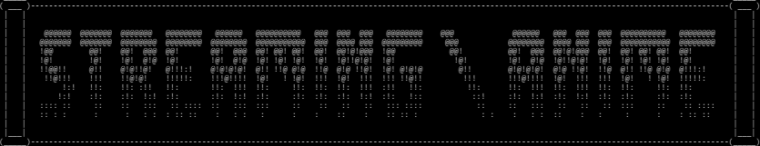

<p align="center">
    
</p>

This repository provide a simple script designed to downloading films and series from a variety of supported streaming platforms. [SITE](#website-status-)

## Join us 🌟

You can chat, help improve this repo, or just hang around for some fun in the **Git_StreamingCommunity** Discord [Server](https://discord.com/invite/8vV68UGRc7)

# Table of Contents

* [INSTALLATION](#installation)
  * [Automatic Installation](#automatic-installation)
    * [Usage](#usage-automatic)
    * [Supported OSs for Automatic Installation](#automatic-installation-os)
  * [Manual Installation](#manual-installation)
    * [Requirement](#requirement)
    * [Usage](#usage-manual)
    * [Win 7](https://github.com/Ghost6446/StreamingCommunity_api/wiki/Installation#win-7)
    * [Termux](https://github.com/Ghost6446/StreamingCommunity_api/wiki/Termux)
  * [Update](#update)
* [CONFIGURATION](#configuration)
* [DOCKER](#docker)
* [TUTORIAL](#tutorial)
* [TO DO](#to-do)

# INSTALLATION

## Automatic Installation

### Supported OSs for Automatic Installation 💿

- Supported ✔️
- Not tested ⏳
- Not supported ❌

| OS              | Automatic Installation Support |
| :-------------- | :----------------------------: |
| Windows 10/11   |              ✔️              |
| Windows 7       |               ❌               |
| Debian Linux    |              ✔️              |
| Arch Linux      |              ✔️              |
| CentOS Stream 9 |              ✔️              |
| FreeBSD         |               ⏳               |
| MacOS           |              ✔️              |
| Termux          |               ❌               |

### Installation ⚙️

Run the following command inside the main directory:

#### On Windows:

```powershell
.\win_install.bat
```

#### On Linux/MacOS/BSD:

```bash
sudo chmod +x unix_install.sh && ./unix_install.sh
```

`<a id="usage-automatic"></a>`

### Usage 📚

Run the script with the following command:

#### On Windows:

```powershell
python .\run.py
```

or

```powershell
source .venv/bin/activate && python run.py && deactivate
```

#### On Linux/MacOS/BSD:

```bash
./run.py
```

## Manual Installation

`<a id="requirement"></a>`

### Requirement 📋

Make sure you have the following prerequisites installed on your system:

* [python](https://www.python.org/downloads/) > 3.8
* [ffmpeg](https://www.gyan.dev/ffmpeg/builds/)
* [openssl](https://www.openssl.org) or [pycryptodome](https://pypi.org/project/pycryptodome/)

### Installation ⚙️

Install the required Python libraries using the following command:

```
pip install -r requirements.txt
```

### Usage 📚

Run the script with the following command:

#### On Windows:

```powershell
python run.py
```

#### On Linux/MacOS:

```bash
python3 run.py
```

### Update

Keep your script up to date with the latest features by running:

#### On Windows:

```powershell
python update_version.py
```

#### On Linux/MacOS:

```bash
python3 update_version.py
```

## Configuration ⚙️

You can change some behaviors by tweaking the configuration file.

The configuration file is divided into several main sections:

### DEFAULT Settings

```json
{
    "root_path": "Video",
    "map_episode_name": "%(tv_name)_S%(season)E%(episode)_%(episode_name)",
    "special_chars_to_remove": "!@#$%^&*()[]{}<>|`~'\";:,?=+\u00e2\u20ac\u00a6",
    "not_close": false,
    "show_trending": false
}
```

- `root_path`: Directory where all videos will be saved

  #### Path examples:


  * Windows: `C:\\MyLibrary\\Folder` or `\\\\MyServer\\MyLibrary` (if you want to use a network folder)
  * Linux/MacOS: `Desktop/MyLibrary/Folder`
    `<br/><br/>`
- `map_episode_name`: Template for TV series episode filenames

  #### Episode name usage:

  You can choose different vars:


  * `%(tv_name)` : Is the name of TV Show
  * `%(season)` : Is the number of the season
  * `%(episode)` : Is the number of the episode
  * `%(episode_name)` : Is the name of the episode
    `<br/><br/>`
- `special_chars_to_remove`: Special characters to be removed from filenames
- `not_close`: If true, continues running after downloading
- `show_trending`: Display trending content on startup

#### qBittorrent Configuration

```json
{
    "config_qbit_tor": {
        "host": "192.168.1.59",
        "port": "8080",
        "user": "admin",
        "pass": "adminadmin"
    }
}
```

To enable qBittorrent integration, follow the setup guide [here](https://github.com/lgallard/qBittorrent-Controller/wiki/How-to-enable-the-qBittorrent-Web-UI).

### REQUESTS Settings

```json
{
    "timeout": 20,
    "max_retry": 3
}
```

- `timeout`: Maximum timeout (in seconds) for each request
- `max_retry`: Number of retry attempts per segment during M3U8 index download

### BROWSER Settings

```json
{
    "headless": false
}
```

- `headless`: Controls whether to run browser in headless mode

### M3U8_DOWNLOAD Settings

```json
{
    "tqdm_delay": 0.01,
    "tqdm_use_large_bar": true,
    "default_video_workser": 12,
    "default_audio_workser": 12,
    "cleanup_tmp_folder": true
}
```

- `tqdm_delay`: Delay between progress bar updates
- `tqdm_use_large_bar`: Use detailed progress bar (recommended for desktop) set to false for mobile
- `default_video_workser`: Number of threads for video download
- `default_audio_workser`: Number of threads for audio download
- `cleanup_tmp_folder`: Remove temporary .ts files after download

#### Language Settings

The following codes can be used for `specific_list_audio` and `specific_list_subtitles`:

```
ara - Arabic       eng - English      ita - Italian     por - Portuguese
baq - Basque       fil - Filipino     jpn - Japanese    rum - Romanian
cat - Catalan      fin - Finnish      kan - Kannada     rus - Russian
chi - Chinese      fre - French       kor - Korean      spa - Spanish
cze - Czech        ger - German       mal - Malayalam   swe - Swedish
dan - Danish       glg - Galician     may - Malay       tam - Tamil
dut - Dutch        gre - Greek        nob - Norw. Bokm  tel - Telugu
                   heb - Hebrew       nor - Norwegian    tha - Thai
forced-ita         hin - Hindi        pol - Polish      tur - Turkish
                   hun - Hungarian                       ukr - Ukrainian
                   ind - Indonesian                      vie - Vietnamese
```

> [!IMPORTANT]
> Language code availability may vary by site. Some platforms might:
>
> - Use different language codes
> - Support only a subset of these languages
> - Offer additional languages not listed here
>
> Check the specific site's available options if downloads fail.

> [!TIP]
> You can configure multiple languages by adding them to the lists:
>
> ```json
> "specific_list_audio": ["ita", "eng", "spa"],
> "specific_list_subtitles": ["ita", "eng", "spa"]
> ```

### M3U8_PARSER Settings

```json
{
    "force_resolution": -1,
    "get_only_link": false
}
```

- `force_resolution`: Force specific resolution (-1 for best available, or specify 1080, 720, 360)
- `get_only_link`: Return M3U8 playlist/index URL instead of downloading

## Docker 🐳

You can run the script in a docker container, to build the image just run

```
docker build -t streaming-community-api .
```

and to run it use

```
docker run -it -p 8000:8000 streaming-community-api
```

By default the videos will be saved in `/app/Video` inside the container, if you want to to save them in your machine instead of the container just run

```
docker run -it -p 8000:8000 -v /path/to/download:/app/Video streaming-community-api
```

### Docker quick setup with Make

Inside the Makefile (install `make`) are already configured two commands to build and run the container:

```
make build-container

# set your download directory as ENV variable
make LOCAL_DIR=/path/to/download run-container
```

The `run-container` command mounts also the `config.json` file, so any change to the configuration file is reflected immediately without having to rebuild the image.

### Website Status 🌐

- Working ✅
- Not Working ❌

| Website            | Status |
| :----------------- | :----: |
| 1337xx             |   ✅   |
| Altadefinizione    |   ✅   |
| AnimeUnity         |   ✅   |
| BitSearch          |   ✅   |
| CB01New            |   ✅   |
| DDLStreamItaly     |   ✅   |
| GuardaSerie        |   ✅   |
| MostraGuarda       |   ✅   |
| PirateBays         |   ✅   |
| StreamingCommunity |   ✅   |

## Tutorial 📖

[win](https://www.youtube.com/watch?v=mZGqK4wdN-k)
[linux](https://www.youtube.com/watch?v=0qUNXPE_mTg)

## To do 📝

- GUI
- Website api
- Add other site
